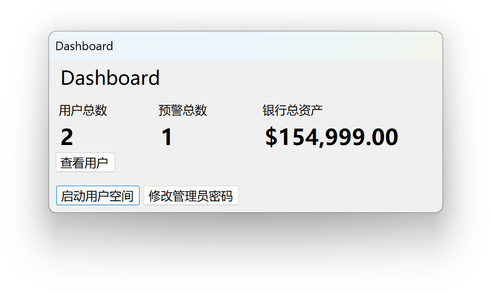
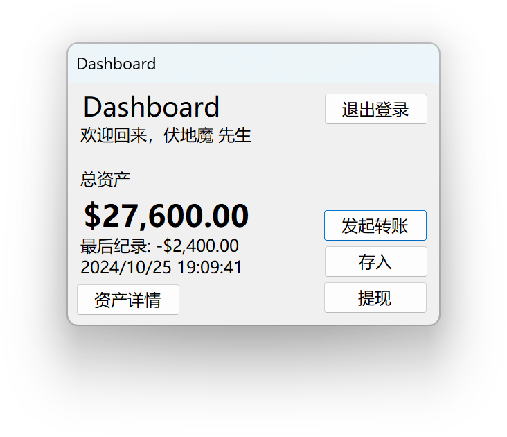

# GIRLS BANK CRY - A Poorly Mimicked ATM BankSystem

## 截图

## 测试说明
- 在 Debug 模式下，密码 “gbc” 可以绕过所有密码格式的检测，这是为了方便调试设置的特性，在 Release 模式下不存在此特性。

## AI 生成内容的说明
本项目在如下部分使用了 AI 生成的内容：
### `Database.cs`
- 部分重复的 Linq 语句在人工完成一边后由 AI 自动生成了数遍。

###	`**/*.cs`
- 文档使用了 AI 自动补全工具，并且在补全完成后人工进行了详细的检查。

## 实现功能
- 注册登录
- 存款 / 取款
- 转账
- 风控管理

### 关于风控管理
常数设置详见 `Globals.cs`

1. 每日每用户取出（包括提现和转出）不得超过 $100,000；
2. 每日每用户入账超过 $50,000 时，从其他账户转入（不包括存款）时会触发风险预警，需要管理员手动批准。

## 局限性
- 所有针对金额的部分都只能处理整数部分，未考虑小数部分。
- 用户资产详情页面与管理员用户列表页面没有对呈现逻辑进行优化。
- 出于时间限制，没有使用本地的数据库连接，导致所有数据仅仅存在在内存中。退出程序或程序异常终止会导致所有数据丢失。
> 针对第三点，此项目将所有有关数据处理的部分集中在 `Models/Database.cs` 中，仅需修改该文件实现对本地数据库的读写操作，即可在不变更 UI 代码的情况下实现对本地数据库的支持。

## Known Issues
自行实现的金额输入页面，输入 '.' 时会触发删除操作。

~~你说的对，但是《GIRLS BANK CRY》是由彩笔自主研发的一款全新模拟 ATM 系统。系统发生在一个被称作「兆京」的幻想城市，在这里，被神选中的人将被授予「Bank Account」，导引货币之力。你将扮演一位名为「Admin」的神秘角色，在不自由的 Dashboard 中邂逅存款各异、能力独特的同伴们，和他们一起击败强敌，找回失散的银行总资产——同时，逐步发掘「风险控制」的真相。~~